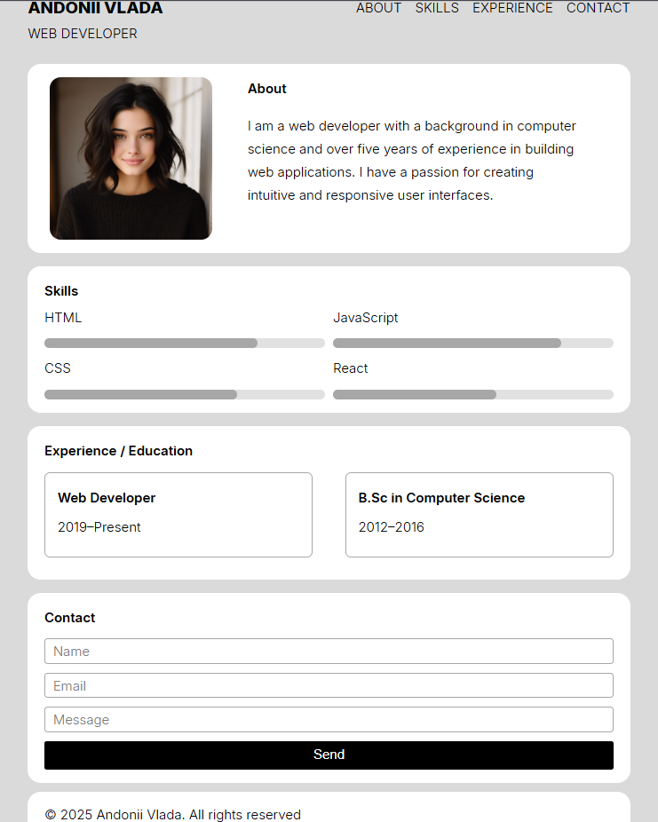
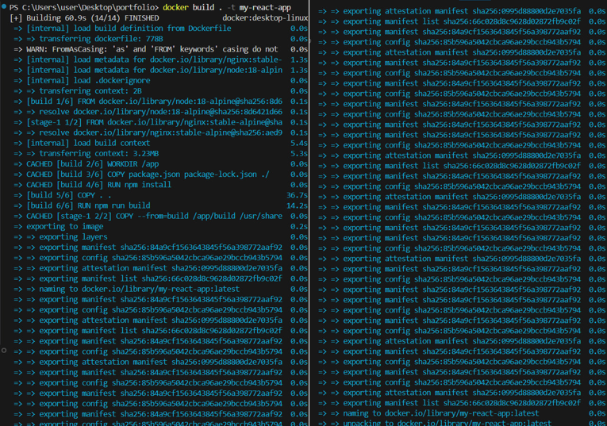
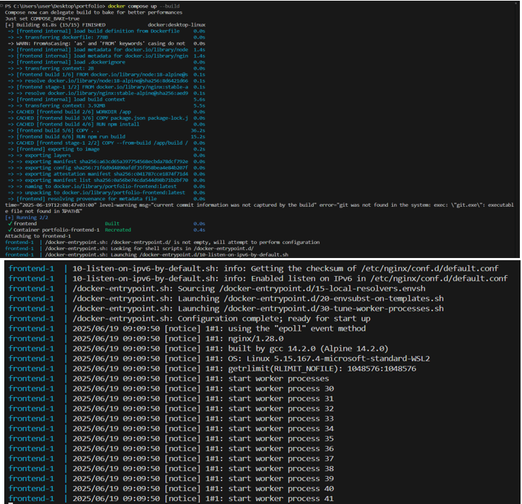

# 🌐 Andonii Vlada — Portfolio Website

Welcome to my personal portfolio website, built with **React**.  
This site showcases who I am, what I do, and how to contact me.  

## ✨ Preview

 

## 🚀 Live Demo

🔗 _Coming soon..._

## 🛠️ Technologies Used

- React
- HTML5 / CSS3
- JavaScript (ES6+)
- Custom CSS (no frameworks)

## 🧱 Project Structure

## 🐳 Docker

### 📦 Сборка Docker-образа

Для создания Docker-образа выполните команду:
docker build -t my-react-app .
 

### ▶️ Запуск контейнера

Запустите приложение с помощью docker-compose:
docker compose up --build .

